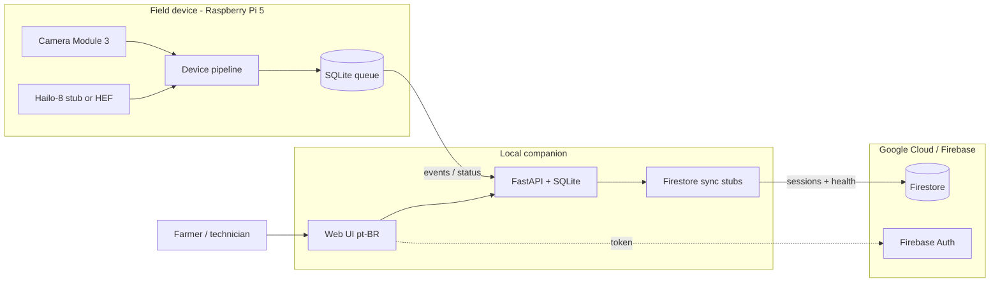
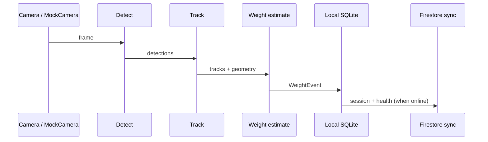
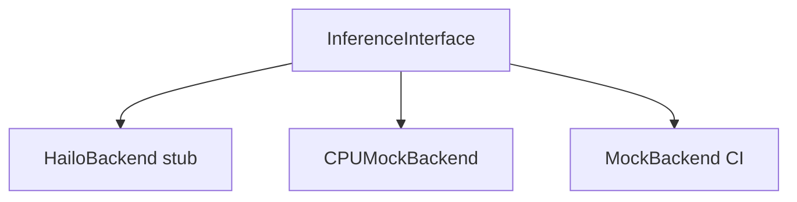

# Architecture: livestock-weight

Offline-first edge on Raspberry Pi 5; local SQLite queue; sync of weighing sessions and device health to **Google Cloud Firestore**. Auth via **Firebase Auth**. Farmer-facing UI ships **pt-BR only** in v1.

## Context diagram

## Data flow

1. Camera frame → detect → track → weight estimate → **WeightEvent**
2. Events land in local **SQLite** (API + optional device buffer)
3. Sync worker (stub) pushes **weighing sessions** and **device health** to Firestore when credentials and network are available
4. No secrets or service-account JSON are committed; config via env / Secret Manager at deploy time

## Pipeline

## Components

| Component | Path | Role |
|-----------|------|------|
| Device runtime | `device/` | Capture, inference backends, pipeline, calibration, health |
| Companion API | `api/` | Events, history, status; SQLite; Firestore sync stubs |
| Web app | `apps/web/` | Live feed (mock), history, status; default locale **pt-BR** |
| ML workspace | `ml/` | Dataset layout, train/eval placeholders, model card |
| Ops | `ops/` | Compose, seed scripts, CI |

## Cloud integration (stubs)

- `api` exposes a sync module that *would* write to Firestore collections such as `weighing_sessions` and `device_health`
- Firebase Auth verifies companion users; edge devices may use service identity configured outside the repo
- **Never** invent or commit API keys, project IDs with secrets, or service-account private keys

## Inference backends

## Calibration

Default camera height **3.0 m**. Calibration stores FOV, ground-plane mapping, and reference-object scale. Weight mapping is species-specific and explicitly placeholder until validated.

## Trust boundaries

- Edge works fully offline; cloud sync is best-effort
- Auth tokens and GCP credentials live in env / secret stores only
- Accuracy is a calibration + model problem—architecture does not imply certified weights

## GCP / Firebase project

- **Project ID:** `boviscan-c2430` (BoviScan)
- Configure via `GOOGLE_CLOUD_PROJECT` (alias `FIREBASE_PROJECT_ID` accepted); credentials stay outside the repo.
