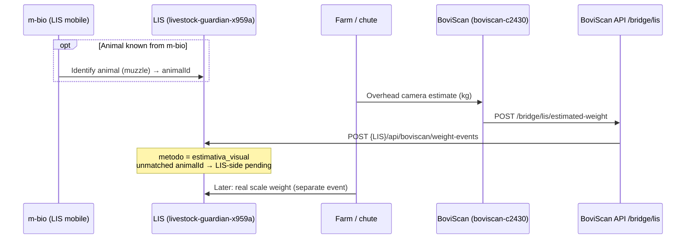
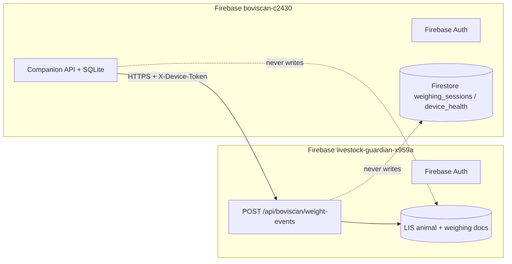

# BoviScan → LIS integration contract

Cross-product bridge between **BoviScan** (visual weight estimate) and **LIS / Livestock Guardian** (animal registry + real scale weighing). This document is the contract only; **do not clone the LIS repo into this workspace**.

| Side | Product | Firebase project | Notes |
|------|---------|------------------|-------|
| Source of visual estimate | **BoviScan** | `boviscan-c2430` | Edge camera → companion API → optional bridge |
| Animal identity + scale | **LIS** (mobile muzzle app brand **m-bio** / `ml-mbio`) | `livestock-guardian-x959a` | Owns animals; later records real scale weight |

Projects are **separate**. There is no shared Firestore database and no cross-project client SDK wiring in v1. Integration is an **HTTP ingest** from BoviScan into LIS (`X-Device-Token`).

## Flow (sequence)



### Timing of IDs

1. **Optional m-bio match:** When the muzzle app has resolved an animal, BoviScan may include `animalId` (and optional `mBioMatch` metadata).
2. **BoviScan always sends the estimate:** Visual kg does **not** wait on identity. Missing / unmatched `animalId` is handled **on the LIS side as pending** — BoviScan does not invent IDs and does not block outbound.
3. **Scale later:** Physical scale weight is recorded **only in LIS**, not mirrored back into BoviScan in this contract.

## Firebase boundaries



- BoviScan sync continues to write only to **`boviscan-c2430`** collections (`weighing_sessions`, `device_health`).
- LIS owns animals and official weighings under **`livestock-guardian-x959a`**.
- Bridge payload is an **event**; unmatched animals stay **LIS-side pending**.

## LIS ingest endpoint

```
POST {LIS_INGEST_URL}/api/boviscan/weight-events
```

`LIS_INGEST_URL` is the LIS **base** URL (scheme + host[+port]), without a trailing path. The bridge appends `/api/boviscan/weight-events`.

### Headers

| Header | Value |
|--------|-------|
| `Content-Type` | `application/json` |
| `X-Device-Token` | Device token from `LIS_DEVICE_TOKEN` (preferred) or `LIS_INGEST_TOKEN` |

### Body (camelCase — LIS wire format)

| Field | Type | Required | Description |
|-------|------|----------|-------------|
| `farmId` | string | yes | Farm / property id known to LIS |
| `deviceId` | string | yes | BoviScan field device id |
| `idempotencyKey` | string | yes | Equals BoviScan `WeightEvent.id` |
| `pesoKg` | number | yes | Visual estimate (kg); must be `> 0` |
| `metodo` | string | yes | Always `estimativa_visual` |
| `confidence` | number | yes | `0..1` |
| `capturedAt` | string (ISO-8601) | yes | Capture / estimate time (UTC preferred) |
| `animalId` | string | no | LIS animal id when known from m-bio |
| `mBioMatch` | object | no | Optional m-bio match metadata |
| `sessionId` | string | no | BoviScan weighing session id |
| `trackId` | string | no | Tracker id for this passage |
| `proxyMetrics` | object | no | Research proxy extras (area, height, …) |
| `species` | string | no | e.g. `cattle` |
| `calibrationId` | string | no | Calibration profile used |

Example:

```json
{
  "farmId": "farm-001",
  "deviceId": "device-local-01",
  "idempotencyKey": "evt-abc-123",
  "pesoKg": 420.5,
  "metodo": "estimativa_visual",
  "confidence": 0.8,
  "capturedAt": "2026-09-12T12:00:00+00:00",
  "animalId": "lis-animal-uuid",
  "mBioMatch": { "score": 0.91, "source": "ml-mbio" },
  "sessionId": "sess-…",
  "trackId": "trk-…",
  "proxyMetrics": { "area_m2": 1.2, "research_proxy": true },
  "species": "cattle"
}
```

- **`metodo` is always `estimativa_visual`** (LIS `registerWeighing` metodo for visual estimates).
- Real scale weighings use a different metodo inside LIS and are **out of scope** here.
- Omitting `animalId` is valid; LIS keeps the event pending until matched.

## Companion API (BoviScan local)

`POST /bridge/lis/estimated-weight` — validates the payload, enqueues outbound, and either stubs or POSTs to LIS.

Inbound fields (snake_case, mapped to the wire body above):

| Field | Maps to | Required |
|-------|---------|----------|
| `farm_id` | `farmId` | yes |
| `device_id` | `deviceId` | yes |
| `idempotency_key` | `idempotencyKey` | yes (= `WeightEvent.id`) |
| `peso_kg` | `pesoKg` | yes |
| `confidence` | `confidence` | yes (`0..1`) |
| `captured_at` | `capturedAt` | yes |
| `animal_id` | `animalId` | no |
| `m_bio_match` | `mBioMatch` | no |
| `session_id` | `sessionId` | no |
| `track_id` | `trackId` | no |
| `proxy_metrics` | `proxyMetrics` | no |
| `species` | `species` | no |
| `calibration_id` | `calibrationId` | no |

`metodo` is set by the bridge (not accepted from clients).

Validation failures → **422**. Successful accept → **200** with queue/outbound mode.

## Auth

| Hop | Mechanism |
|-----|-----------|
| Operator / device → BoviScan API | Optional Firebase Auth on BoviScan (`FIREBASE_AUTH_ENABLED`); same rules as other mutating routes |
| BoviScan bridge → LIS ingest | Header `X-Device-Token: <token>` |

Env (see `.env.example` / `api/.env.example`):

```bash
# Leave unset for local stub (accept + queue, no HTTP)
# LIS_INGEST_URL=https://lis.example
# LIS_DEVICE_TOKEN=replace-me-outside-repo
# LIS_INGEST_TOKEN is accepted as an alias for LIS_DEVICE_TOKEN
```

Never commit real tokens. LIS service-account JSON stays in the LIS project; BoviScan only needs the **base URL + device token** LIS issues for this bridge.

## Outbound modes

| Mode | When | Behavior |
|------|------|----------|
| `stub` | `LIS_INGEST_URL` empty | Validate, enqueue locally (`sync_outbox` entity `lis_estimated_weight`), **no HTTP** |
| `forwarded` | URL set + HTTP 2xx | Enqueue then `POST …/api/boviscan/weight-events`; clear outbox on success |
| `queued` | URL set + HTTP failure / unreachable | Payload remains in outbox for retry; response still `ok` with `mode=queued` and error detail |

Local SQLite remains the BoviScan source of truth for the estimate. LIS remains source of truth for animals, pending matches, and scale kg.

## Explicit non-goals

- Cloning or vendoring the LIS codebase
- Writing directly to `livestock-guardian-x959a` Firestore from BoviScan
- Inventing `animalId` when m-bio has not identified the animal
- Claiming visual kg equals scale kg

## Related

- BoviScan Auth: `docs/AUTH.md`
- Edge / companion data model: `docs/DATA_MODEL.md`
- Companion endpoint: `POST /bridge/lis/estimated-weight`
